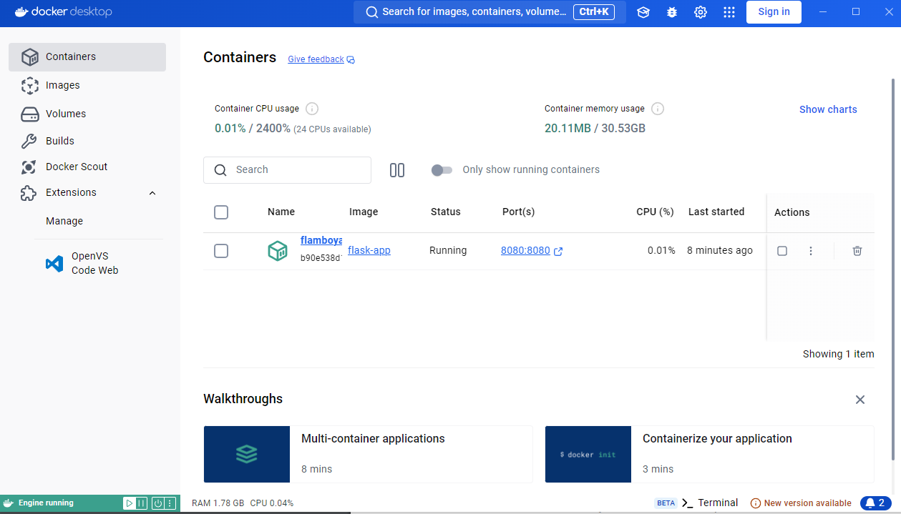

# Documentaçao do trabalho

## Passo 1

- Foi realizado a instação do Docker

## Passo 2

- Criei um diretório de projeto e configurei uma aplicação Flask simples usando esses comandos.

- mkdir flask-docker

- cd flask-docker

## Passo 3

- Criei um arquivo Dockerfile que define como a imagem Docker deve ser construída.

## Passo 4

- Editei o Dockerfile

## Passo 5

- Construí a imagem Docker usando o Dockerfile.

- No terminal, executei o comando para construir a imagem Docker:

- docker build -t flask-app .

## Passo 6

- Executei um contêiner a partir da imagem Docker criada.

- docker run -p 8080:8080 flask-app

## Passo 7

- Acessei a aplicação Flask via navegador para verificar se está funcionando.

### Captura de tela do navegador

 

### Captura de tela do Docker

 
